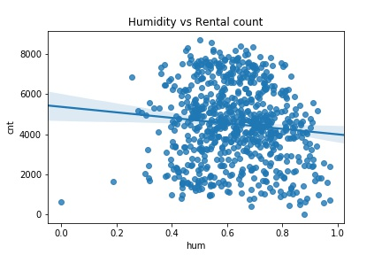
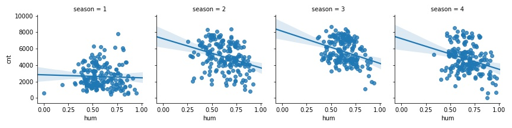
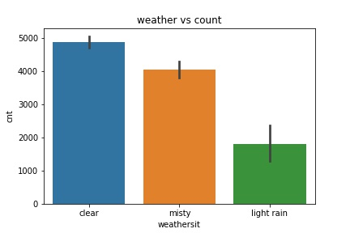
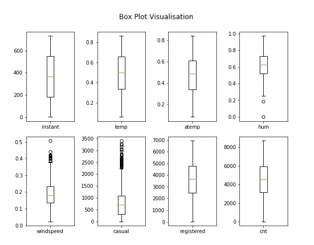

# Prediction of bike rental count based on environmental and work conditions

_Shafeeq Ahmed_

## Problem Statement

_The objective of this project is to predict the count of bikes rented by both casual as well as registered users on a daily basis. The rental count is affected by a number of environmental factors as will be depicted by exploratory analysis of the acquired dataset. Our aim, therefore, is to build a model that can predict the count of rental bikes by exploring and taking in to account, the various features of the dataset._

## Exploratory Data Analysis

### Important Visualisations

_Here we highlight some of the predictor variables and their influence on the number of bikes rented by the customers._

_A Scatterplot displaying the spread of rental count throughout the given duration 2011-2012 is given below with the data points colour coded with corresponding seasons._

_A lot of information is revealed in this plot including the fact that the rental count is more elevated in 2012 than 2011 as indicated by the regression lines. We could clearly see that the rental count is at its minimum during spring, starts rising throughout summer and reaches its maximum during autumn after which it begins to fall during winter. This overall inverse parabolic trend holds true for both the years_

_A scatter plot to depict the effect of humidity on rental count is given below_

_When we look at the humid conditions (represented by &#39;hum&#39; variable) prevalent throughout 2011-2012 its influence on the rental count is not so apparent at first. But when we consider the corresponding season, there is a declining trend in rental count with increase in humidity as clearly shown below_

_Hence we can safely conclude that as the season progresses from spring to winter, humidity inversely affects the rental count which also makes sense as riding a bike out in the open is less favourable in more humid conditions. This relationship also holds true for wind speed._

_The relationship between the generic weather and rental count also reveals interesting information. The bar graph indicating the average number of bikes rented during various weather conditions is given below_

_The average number of bikes rented when there were clear weather conditions differs from the average number of bikes rented when there were little or a decent chance for rain by a significant margin. From this, we can derive the conclusion that there is a better chance for customers renting more bikes when there is little or no chance for rain._

## Data Pre-Processing

### Outlier detection and removal

_The below Figure shows that the variables hum, windspeed and casual contains outliers which must be removed before proceeding further. The data points that lie beyond the extreme boundaries are classified as outliers and removed._

### Feature Selection

_The data acquired for resolving a particular problem statement may not always be fully relevant to the case in point. Since there may be multiple sources from where data is extracted, there is a good chance for irrelevant features to find their way in to the dataset. If a predictor variable that has no useful information to predict the outcome of a response variable is included in training set of our model, it can cause severe performance degradation of the model._

_Moreover, if two or more predictor variables included in the dataset contains the same information or in technical terms, highly correlated, then the redundant information can also impact the performance of our model. Hence it is a usual practice to subject the features to statistical tests like correlation analysis to determine the level of contribution they make to the prediction of response variables. The following heat map visualises the pairwise correlation between numerical variables of the dataset._

_As for as irrelevant variables are concerned, we can safely remove the below two variables for the cited reasons._

1. _instant_ __ _we can remove this variable as this is a mere index of the observations_
2. _dteday_ __ _this variable can be removed as the mnth and yr variables sufficiently cover the information provided by it._

## Model Selection

_As we have already defined in our problem statement, the main goal of this project is to predict the count of bikes rented on any given day and hence, our problem statement falls under the category &quot;regression&quot;. We can choose a variety of machine learning algorithms for regression type. For this project, the following 4 algorithms are chosen and their performance is evaluated on the same train and test data to select the best one of them._

1. _Multiple Linear Regression_
2. _Decision Tree_
3. _Random Forest_
4. _KNN_

## Conclusion

_After Analysing the performance statistics of individual models, it is evident that Random Forest performs significantly well and the prediction prevails over other models by a clear margin. Hence Random forest can be selected for predicting the bike rental count for future test cases and the same can be used for deployment._

_Important Note:_ _this is just a brief overview of the project which helps in highlighting the key factors at a superficial level. It is highly recommended that the viewers kindly go through the detailed project report which portrays the performance metrics and the code used in a very elaborate manner._
